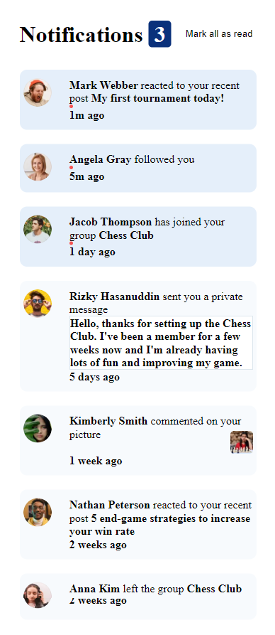
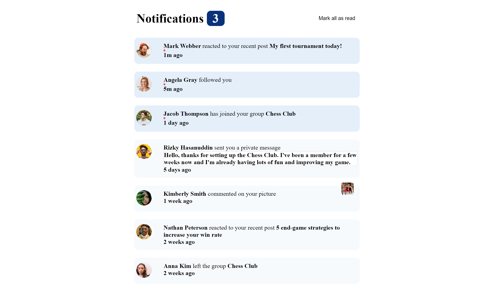

# Frontend Mentor - Notifications page solution

This is a solution to the [Notifications page challenge on Frontend Mentor](https://www.frontendmentor.io/challenges/notifications-page-DqK5QAmKbC). Frontend Mentor challenges help you improve your coding skills by building realistic projects. 

## Table of contents

- [Overview](#overview)
  - [The challenge](#the-challenge)
  - [Screenshot](#screenshot)
  - [Links](#links)
- [My process](#my-process)
  - [Built with](#built-with)
  - [What I learned](#what-i-learned)
  - [Continued development](#continued-development)
- [Author](#author)
- [Acknowledgments](#acknowledgments)

## Overview

### The challenge

Users should be able to:

- Distinguish between "unread" and "read" notifications
- Select "Mark all as read" to toggle the visual state of the unread notifications and set the number of unread messages to zero
- View the optimal layout for the interface depending on their device's screen size
- See hover and focus states for all interactive elements on the page

### Screenshot





### Links

- Solution URL: [Github](https://github.com/Haywayaheadshot/notifications-page-main)
- Live Site URL: [Live Demo](https://haywayaheadshot.github.io/notifications-page-main/)

## My process

### Built with

- Semantic HTML5 markup
- CSS
- Flexbox
- CSS Grid
- Mobile-first workflow
- Javascript
- Github
- Vscode

### What I learned

I learnt to manipulate object keys and values. And most importantly I learnt how to debug my code using console.log properly.

```js
const proudOfThisFunc = () => {
  if (el.unread) {
    // display red dot
    redDot.style.display = 'flex';

    // Check for the unread messages and push to an unreadArr
    unreadArr.push(Object.values(el));
  } else {
    redDot.style.display = 'none';
    displayLi.classList.replace('update-li', 'update-li-read');
  }
}
```

### Continued development

I will like to work on more JavaScript problems. I want to focus on the being able to learn how to manipulate data to suit my desire.

## Author

- Github - [Abubakar Ummar](https://github.com/Haywayaheadshot)
- Frontend Mentor - [@Haywayaheadshot](https://www.frontendmentor.io/profile/Haywayaheadshot)
- Twitter - [@haywayalive](https://twitter.com/haywayalive)

## Acknowledgments

- Thanks to Microverse for knowledge impacted.

